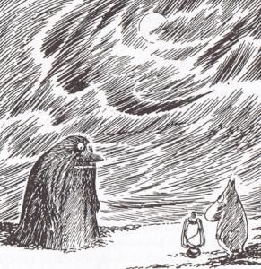

# Federated learning for appliance energy consumption prediction

  
   

This repository contains the code for Assignment 2 in the course IN9460: AI for Energy Informatics, by Lucas Georges Gabriel Charpentier and Sondre Wold.
